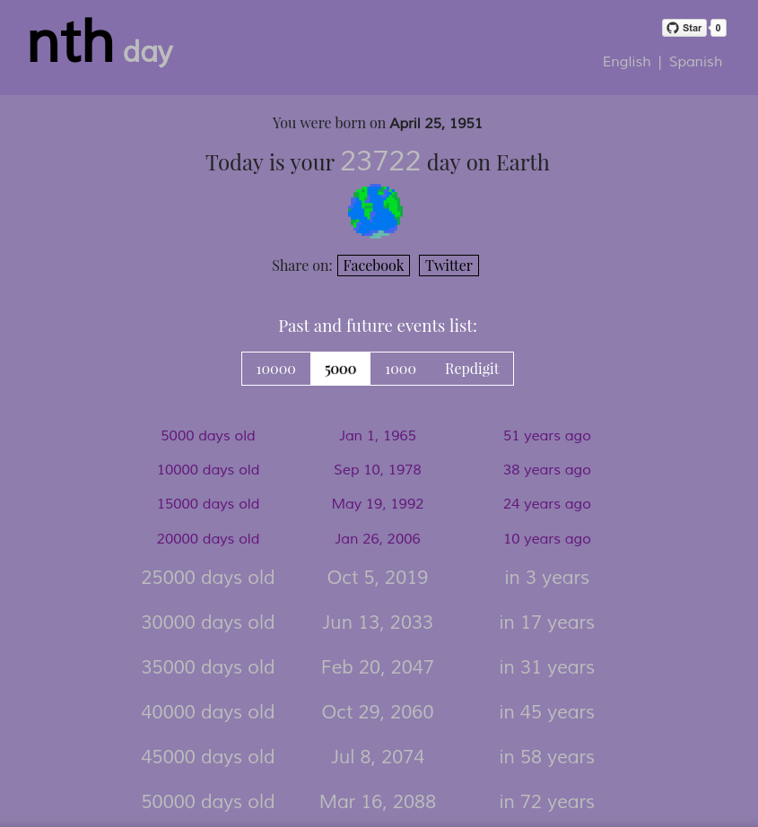

# nth-days-old

### Calculate how many days you've been on Earth!

Filter by 10000, 5000 or Repdigit days.

## Technical overview

This application has been built with the following technologies:

- [React](https://facebook.github.io/react/) (UI)
- [Redux](https://redux.js.org/) (Flux architecture)
- [Moment.js](https://momentjs.com/) (To handle dates)
